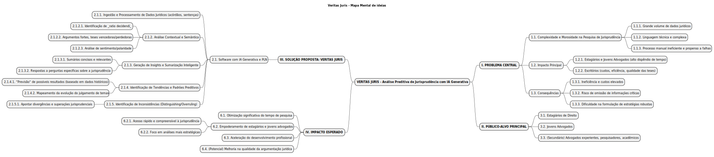

## Introdução ao Mapa Mental

Mapas mentais são ferramentas visuais poderosas utilizadas para organizar informações de forma hierárquica e associativa. Partindo de um conceito central, os mapas mentais se ramificam em ideias secundárias, terciárias e assim por diante, utilizando palavras-chave, cores e imagens para representar e conectar diferentes aspectos de um tema complexo. No contexto de um projeto como o "Veritas Juris", especialmente em um ambiente dinâmico como um hackathon, um mapa mental auxilia na visualização rápida da estrutura da ideia, seus componentes principais, interdependências e o escopo geral, facilitando a comunicação entre os membros da equipe e a apresentação concisa do projeto.

## Metodologia e Ferramentas

O mapa mental do projeto "Veritas Juris" foi estruturado para refletir as principais dimensões da solução, partindo da identificação do problema central que visa solucionar, detalhando a solução proposta com suas funcionalidades baseadas em Inteligência Artificial Generativa, identificando o público-alvo e, por fim, o impacto esperado no mercado jurídico. Para a criação deste mapa mental, optou-se pela utilização da ferramenta PlantUML. O PlantUML permite gerar diversos tipos de diagramas, incluindo mapas mentais, a partir de uma linguagem de script simples e intuitiva. Essa abordagem "diagrama como código" facilita o versionamento, a colaboração e a manutenção do mapa mental. O resultado gerado pelo PlantUML pode ser facilmente exportado para diversos formatos, incluindo SVG (Scalable Vector Graphics), um formato vetorial ideal para a web, garantindo clareza e escalabilidade da visualização.

## Visualização do Mapa Mental do Veritas Juris

A seguir, é apresentado o mapa mental do projeto "Veritas Juris". Ele consolida visualmente os elementos chave da iniciativa, conforme discutido e refinado para o "Desafio de IA - o uso aplicado de ferramentas de Inteligência Artificial Generativa" do Ibmec[cite: 1].

[]

Este mapa mental serve como um guia visual rápido para entender a essência e a estrutura do Veritas Juris, facilitando a compreensão dos seus objetivos.

